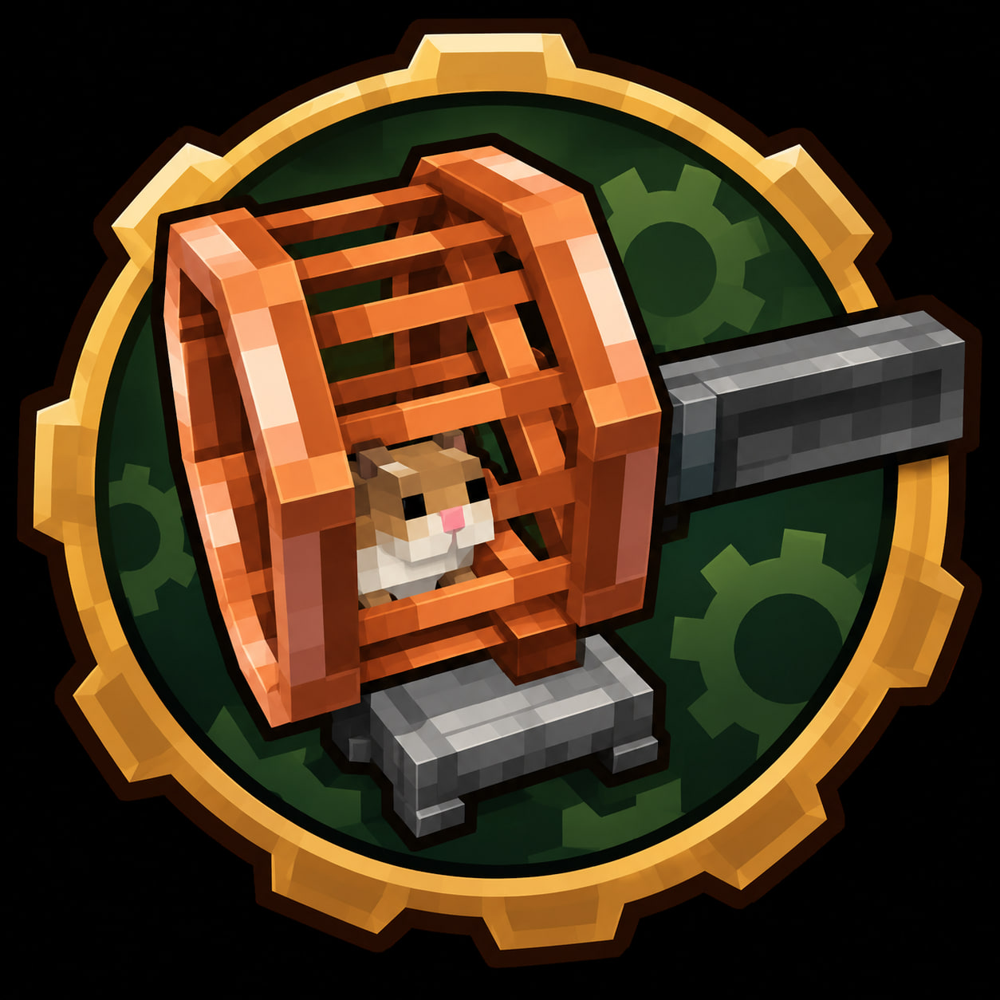

# Create: Hamsters Compat



[English version](README.md)

Компат-мод для [Create](https://modrinth.com/mod/create) и [Hamsters](https://modrinth.com/mod/hamsters) на **Minecraft 1.20.1**.

К ступице колеса хомяка можно подключить вал Create. Пока хомяк бежит, вал крутится в ту же сторону, что и колесо.

## Возможности

- Вал стыкуется только со стороны ступицы со спицами у `hamsters:hamster_wheel`, не со стороны стойки.
- Скорость и стресс по умолчанию как у ручки Create: **32 RPM** и **8 SU/RPM** (256 SU).
- ПКМ по пустому колесу с хомяком в руке сажает его в колесо.
- ПКМ пустой рукой по занятому колесу забирает хомяка обратно.
- По умолчанию хомяк не выходит из колеса сам (серверная настройка).
- Когда хомяк впервые крутит подключённый вал, ближайшие игроки получают достижение **Эксплуатация...**
  (русский или английский — как язык игры).

## Про лоадер (1.20.1)

Create 6.0.8 на 1.20.1 ставится и на Forge, и на NeoForge. Hamsters 1.0.3 выпускается как Forge-jar. NeoForge 20.1.x ещё использует пакеты `net.minecraftforge` и этот jar подхватывает. Публичный инсталлятор NeoForge 1.20.1 позже сняли, поэтому проект собирается через ForgeGradle / Forge 47.x. Тот же jar компата рассчитан на Forge 47 и NeoForge 20.1. Точка входа — `javafml`; Kotlin for Forge остаётся обязательной библиотекой.

Порт на 1.21.1 уйдёт на пакеты NeoForge, `neoforge.mods.toml`, Kotlin for Forge 5.x и ветку Hamsters `1.21.1-Neo`. Игровые правила лежат в `src/logic`, чтобы порт оставался узким.

## Зависимости

| Мод | Версия |
| --- | --- |
| Minecraft | 1.20.1 |
| Forge 47.x или NeoForge 20.1.x | 47+ |
| [Kotlin for Forge](https://modrinth.com/mod/ordsPcFz) | 4.12.0 |
| [Create](https://modrinth.com/mod/create) | 6.0.8 |
| [Hamsters](https://modrinth.com/mod/hamsters) | 1.20.1-1.0.3 (Forge) |
| [GeckoLib](https://modrinth.com/mod/geckolib) | 4.4.9 (зависимость Hamsters) |

## Настройки

Список модов → Create: Hamsters Compat → Config. Настройки берутся с сервера: в одиночке и у хоста LAN — из локального мира, на выделенном сервере клиентские правки не действуют.

- Текущий мир: `saves/<world>/serverconfig/hamsterscreatecompat-server.toml`
- Шаблон для новых миров: `defaultconfigs/hamsterscreatecompat-server.toml`

| Ключ | По умолчанию | Смысл |
| --- | --- | --- |
| `hamsterExitsWheelOnItsOwn` | `false` | Если false, хомяк сидит, пока игрок его не заберёт. |
| `generatedRpm` | `32` | Обороты, пока хомяк бежит. |
| `stressCapacityPerRpm` | `8.0` | Ёмкость стресса Create на 1 RPM (как у ручки). |

## Сборка

Нужен JDK 17:

```bash
./gradlew -b logic.gradle test
./gradlew build collectReleaseArtifacts
```

`logicTest` не запускает Minecraft. `build` в первый раз делает полный сетап ForgeGradle.

## Релизы

Каждый пуш собирает GitHub Release с jar компата и зависимостями: Create, Hamsters, Kotlin for Forge, GeckoLib. У каждого файла на странице релиза GitHub показывает SHA-256.

## Лицензия

[MIT](LICENSE). Create, Hamsters, Kotlin for Forge и GeckoLib остаются на своих лицензиях.
